 


 2407.05059 
 Kyobin Choo et el. 
 



↗ arXiv


↗ Hugging Face


↗ Papers with Code


### TL;DR



Generating realistic brain MRIs from readily available CT scans is highly desirable in healthcare.  However, existing methods using deep learning models often struggle with two key problems: (1) **Slice inconsistency**, where the generated 3D MRI shows unnatural variations across slices, and (2) **High computational cost**, especially for 3D models which require significant computing resources. These issues limit the practical application of such technology.

This research tackles these challenges by introducing a novel approach. Instead of using computationally expensive 3D models, the researchers developed a **2D model combined with two clever techniques**: Style Key Conditioning (SKC) for ensuring consistent style across the slices, and Inter-Slice Trajectory Alignment (ISTA) for connecting the slices smoothly.  This novel combination **produced significantly better 3D MRI results compared to existing methods**, while remaining computationally efficient.  The findings demonstrate a promising new path towards more accessible and effective medical image translation.



#### Key Takeaways


 A novel 2D Brownian Bridge Diffusion Model (BBDM) successfully performs high-quality 3D CT-to-MRI translation. 



 Style Key Conditioning (SKC) and Inter-Slice Trajectory Alignment (ISTA) effectively address slice inconsistencies in 3D volume generation. 



 The proposed method outperforms existing 2D and 3D baselines in terms of image quality and efficiency. 


#### Why does it matter?
This paper is important because it presents a novel approach to 3D medical image-to-image translation that addresses the challenges of slice inconsistency and high computational costs associated with existing methods.  **Its successful use of a 2D model with novel Style Key Conditioning (SKC) and Inter-Slice Trajectory Alignment (ISTA) offers a more efficient and effective solution for generating high-quality 3D MRI volumes from CT scans.**  This opens up avenues for research into more efficient and accurate medical image synthesis techniques.

------
#### Visual Insights

> 🔼 This figure illustrates the problem of slice inconsistency in 3D volumetric image generation using 2D Brownian Bridge Diffusion Models (BBDMs).  The leftmost image shows a source CT scan. The middle image demonstrates the output of a standard multi-slice 2D BBDM, which suffers from significant inconsistencies in both intensity (brightness and contrast) and shape (structural discontinuities) across different slices of the 3D volume.  The rightmost image showcases the results obtained using the proposed method which successfully addresses the slice inconsistency issue, resulting in a more consistent and accurate 3D MRI reconstruction.
> 

> 
read the caption

> Figure 1:  Examples of slice inconsistency and resolved outcomes. This figure displays the coronal view of volumes synthesized by two 2D BBDMs trained on axial slices. The pure multi-slice 2D BBDM exhibits severe slice inconsistency, with noticeable discontinuities in both style and shape across slices. Our method produces slice-consistent volumes and can adjust the intensity histogram (i.e., style).
> 


| Methods | CT→MRI (in-house) | FLAIR→T1 (BraTS) |
|---|---|---|
|---|---|---|
| NRMSE↓ | PSNR↑ | SSIM↑ | NRMSE↓ | PSNR↑ | SSIM↑ |
|---|---|---|---|---|---|---|
| **3D** |  |  |  |  |  |  |
| RevGAN | 0.0577 | 25.344 | 0.8925 | 0.0824 | 22.073 | 0.8370 |
| ALDM (200 step) | 0.0673 | 23.495 | 0.8474 | 0.0975 | 20.453 | 0.7921 |
| **2D** |  |  |  |  |  |  |
| MaskGAN | 0.0910 | 21.328 | 0.7421 | 0.1112 | 19.311 | 0.7222 |
| Palette (1000 step) | 0.0811 | 21.877 | 0.4365 | 0.1495 | 16.974 | 0.4276 |
| **Ours (100 step)** | **0.0515** | **26.666** | **0.9199** | **0.0808** | **22.579** | **0.8837** |

> 🔼 This table presents a quantitative comparison of the proposed method against several baseline models for brain CT-to-MRI translation.  The comparison is done using three metrics: Normalized Root Mean Square Error (NRMSE), Peak Signal-to-Noise Ratio (PSNR), and Structural Similarity Index Measure (SSIM).  Results are shown for both an in-house CT-MRI dataset and the FLAIR-T1 MRI dataset from BraTS2023.  The metrics provide an objective evaluation of the image quality and similarity between the generated MRI images and the ground truth MRI images.
> 

> 
read the caption

> Table 1: Quantitative comparison with baselines
> 

### In-depth insights

#### 2D DM for 3D I2I
The core idea of using 2D diffusion models (DMs) for 3D image-to-image translation (I2I) presents a compelling trade-off between computational efficiency and performance.  **2D DMs are significantly less computationally expensive than their 3D counterparts**, making them attractive for applications with limited resources. The challenge, however, lies in ensuring slice consistency in the generated 3D volume.  Naive application of a 2D DM to each slice independently leads to inconsistencies in style and shape across slices. The paper addresses this by introducing innovative techniques like **style key conditioning (SKC)** to control the overall style consistency and **inter-slice trajectory alignment (ISTA)** to ensure structural coherence between adjacent slices. This approach cleverly leverages the strengths of 2D DMs while mitigating their weaknesses, paving the way for a **cost-effective and high-quality solution for 3D medical image translation**. The success of this method hinges on the effectiveness of SKC and ISTA in enforcing both global style and local structural consistency, offering a viable alternative to more resource-intensive 3D DM approaches.

#### SKC and ISTA
The proposed methods, Style Key Conditioning (SKC) and Inter-Slice Trajectory Alignment (ISTA), are crucial for achieving high-quality 3D medical image-to-image translation using only a 2D Brownian bridge diffusion model.  **SKC addresses the global style inconsistency** by conditioning the model with the MRI's histogram, thus controlling the generated image's style and ensuring consistency across slices. This allows for manipulation of the target MRI's style.  **ISTA tackles local slice inconsistency** by deterministically aligning the sampling trajectory of adjacent slices, achieving both style and shape consistency across the 3D volume.  It does this by aggregating multiple predictions to co-predict the direction of the next step and correcting the transition error, ensuring a smooth and coherent 3D output.  The combination of SKC and ISTA is key to overcoming the limitations of using a 2D model for 3D tasks, producing superior results to existing 2D and 3D methods.  **The method's novelty lies in its ability to achieve high-quality 3D medical I2I with a 2D model, avoiding the computational cost and data dependency of 3D models.**  This approach demonstrates a significant advancement in the field, offering a practical and effective solution for 3D medical image synthesis.

#### Ablation Study
An ablation study systematically removes components of a model to assess their individual contributions.  In this context, it would involve evaluating the performance of the CT-to-MRI translation model by progressively disabling key features, such as **Style Key Conditioning (SKC)** and **Inter-Slice Trajectory Alignment (ISTA)**.  By comparing the results of models with and without these features, the study could quantify the impact of each on several metrics, such as **NRMSE, PSNR, and SSIM**.  **Significant performance degradation** after removing either SKC or ISTA would strongly support their importance in achieving slice consistency and high-quality image translation.  Conversely, **minimal impact** would suggest that these components are either redundant or less crucial than initially hypothesized.  A well-designed ablation study can provide valuable insights into the model's architecture, guiding future improvements and refinement.  A thoughtful study will likely incorporate various SKC strategies (e.g., using averaged histograms, histograms from a specific brain model, or the target's histogram), further elucidating SKC's role in style control and consistency.

#### Style Control
Style control in image-to-image translation, especially in medical imaging, is crucial for generating realistic and clinically useful results.  The paper explores this by introducing **Style Key Conditioning (SKC)**, leveraging the MRI's histogram as a style key to guide the generation process.  This allows for **direct manipulation of the generated image's style**, such as brightness and contrast, ensuring consistency across slices.  The effectiveness of SKC highlights the importance of incorporating style information directly into the model, moving beyond simply learning mappings between source and target images.  The approach is especially relevant in medical applications where consistent stylistic attributes are critical for diagnostic accuracy and reliability.  However, while SKC addresses global style consistency, it doesn't fully resolve local inconsistencies between slices. Therefore, the paper's approach is a significant step in enhancing control over style in 3D volumetric image generation.  Furthermore, the combination of SKC and the proposed inter-slice trajectory alignment (ISTA) represents a holistic strategy for controlling both global and local aspects of image synthesis. This demonstrates a thoughtful approach to controlling style through both global conditioning and local regularization.

#### Future Work
Future research directions stemming from this slice-consistent 3D CT-to-MRI translation method using a 2D Brownian Bridge Diffusion Model could explore several promising avenues.  **Expanding the model to handle other modalities beyond CT and MRI**, such as PET or ultrasound, would significantly broaden its applicability in medical image analysis.  Investigating **alternative style conditioning methods** beyond histogram-based approaches, perhaps leveraging learned representations of image style or incorporating anatomical landmarks, could lead to more nuanced and robust style transfer.  **Improving the efficiency of the ISTA sampling method** is crucial for scaling to larger volumes and higher resolutions; exploring approximate inference techniques or optimized parallel processing strategies could improve computational performance.  Finally, **rigorous clinical validation** of the generated MRI images is essential to ensure their reliability and diagnostic utility in real-world clinical settings. This might involve comparing diagnostic performance using synthetic MRI to that from actual scans, evaluating the sensitivity and specificity of diagnoses made with synthetic versus real MRI, and assessing the impact on clinical decision-making.

### More visual insights

More on figures

> 🔼 Figure 2 illustrates the training and sampling process of the proposed method for 3D volumetric brain CT-to-MRI translation using a 2D Brownian Bridge Diffusion Model (BBDM). (a) shows the training phase where a multi-slice BBDM is trained by injecting a style key (derived from the MRI histogram) into the U-Net, which learns to map the style of the input CT slices to that of the target MRI slices.  The training process ensures style consistency across slices. (b) depicts the sampling phase, which uses a Predictor-Corrector approach to ensure both style and shape consistency in the generated 3D volume. The 'co-prediction' step combines predictions from multiple slices to create a preliminary prediction, and the 'correction' step refines this prediction to align with the desired style and shape using a score-guided deterministic process. This two-step approach ensures that the generated 3D MRI volume is consistent across slices and faithfully reflects the structure and style of the input CT volume.
> 

> 
read the caption

> Figure 2:  Training and sampling scheme of the proposed methods. (a) During the multi-slice BBDM training, a target histogram-based style key is injected into the U-Net. (b) Target volume sampling proceeds in the manner of the Predictor-Corrector method. During the co-prediction phase, multiple ϵθ,ti,ksubscriptsuperscriptbold-italic-ϵ𝑖𝑘𝜃𝑡\bm{\epsilon}^{i,k}_{\theta,t}bold_italic_ϵ start_POSTSUPERSCRIPT italic_i , italic_k end_POSTSUPERSCRIPT start_POSTSUBSCRIPT italic_θ , italic_t end_POSTSUBSCRIPT are employed to establish connections among the predicted slices within 𝑿¯t−1subscriptbold-¯𝑿𝑡1\bm{\bar{X}}_{t-1}overbold_¯ start_ARG bold_italic_X end_ARG start_POSTSUBSCRIPT italic_t - 1 end_POSTSUBSCRIPT. In the subsequent correction phase, the co-predicted volume is refined through a score-guided deterministic process.
> 

> 🔼 Figure 3 illustrates the ISTA (Inter-slice Trajectory Alignment) sampling method, a key component of the proposed approach for generating slice-consistent 3D volumetric brain CT-to-MRI translations using a 2D Brownian Bridge Diffusion Model.  The figure shows how the model handles inconsistencies that arise from processing multiple slices independently.  Specifically, it highlights the 'co-prediction' step, where predictions from multiple slices are combined to create a unified direction for the next sampling step, and the 'correction' step, which ensures the resulting prediction aligns with the expected manifold, leading to coherent and consistent results across slices. This addresses the challenge of maintaining consistency in style and shape between individual slices in a 3D volume when using a 2D model.
> 

> 
read the caption

> Figure 3: Visualization of the latent space and algorithm for ISTA sampling. The trained U-Net produces inconsistent outputs for multi-slice inputs that include the it⁢hsuperscript𝑖𝑡ℎi^{th}italic_i start_POSTSUPERSCRIPT italic_t italic_h end_POSTSUPERSCRIPT slice. The co-prediction unifies the direction of these independent inferences, while the correction aligns the co-predicted 𝒙¯tisuperscriptsubscript¯𝒙𝑡𝑖\bar{\bm{x}}_{t}^{i}over¯ start_ARG bold_italic_x end_ARG start_POSTSUBSCRIPT italic_t end_POSTSUBSCRIPT start_POSTSUPERSCRIPT italic_i end_POSTSUPERSCRIPT onto the manifold of 𝒙tisubscriptsuperscript𝒙𝑖𝑡\bm{x}^{i}_{t}bold_italic_x start_POSTSUPERSCRIPT italic_i end_POSTSUPERSCRIPT start_POSTSUBSCRIPT italic_t end_POSTSUBSCRIPT.
> 

> 🔼 Figure 4 presents a qualitative comparison of brain CT to MRI translation results generated by various methods, including MaskGAN, Palette, RevGAN, ALDM, and the proposed method.  The figure visually showcases the performance of each method by displaying synthesized MRI images from a common source CT scan. This allows for a direct comparison of image quality and structural accuracy across the different approaches.  The goal is to demonstrate the superior performance of the proposed method in generating high-quality, slice-consistent 3D MRI images from CT scans.
> 

> 
read the caption

> Figure 4:  Qualitative comparison with baselines (CT→→\rightarrow→MRI)
> 

> 🔼 This table details the characteristics of the two datasets used in the experiments: an in-house CT-MRI dataset and the publicly available BraTS2023 FLAIR-T1 MRI dataset.  For each dataset, the table provides the total number of images, the number of images used for training and testing, the dimensions (shape) of the image volumes, and the voxel size (resolution).
> 

> 
read the caption

> Table 3: Dataset details
> 

> 🔼 Table 4 details the settings used for implementing the proposed method and baseline models. It lists the batch size, number of iterations, lambda (λ) value, number of sampling steps, and GPU used for training the different models.  These details are crucial for reproducibility and understanding the computational resources required for training and evaluating each model.
> 

> 
read the caption

> Table 4: Implementation details
> 

> 🔼 Figure 5 presents a qualitative comparison of brain MRI generation results from FLAIR (source) to T1 (target) images using different methods. It visually demonstrates the performance of various methods, including MaskGAN, Palette, RevGAN, ALDM, and the proposed approach. Each column showcases a sample of generated images using a different method. This allows for a direct visual comparison of image quality, level of detail, and overall similarity to the true T1 images. The figure provides a clear visualization of how well each model generates realistic and accurate brain MRIs from FLAIR input images.
> 

> 
read the caption

> Figure 5: Qualitative comparison with baselines (FLAIR→→\rightarrow→T1)
> 

### Full paper


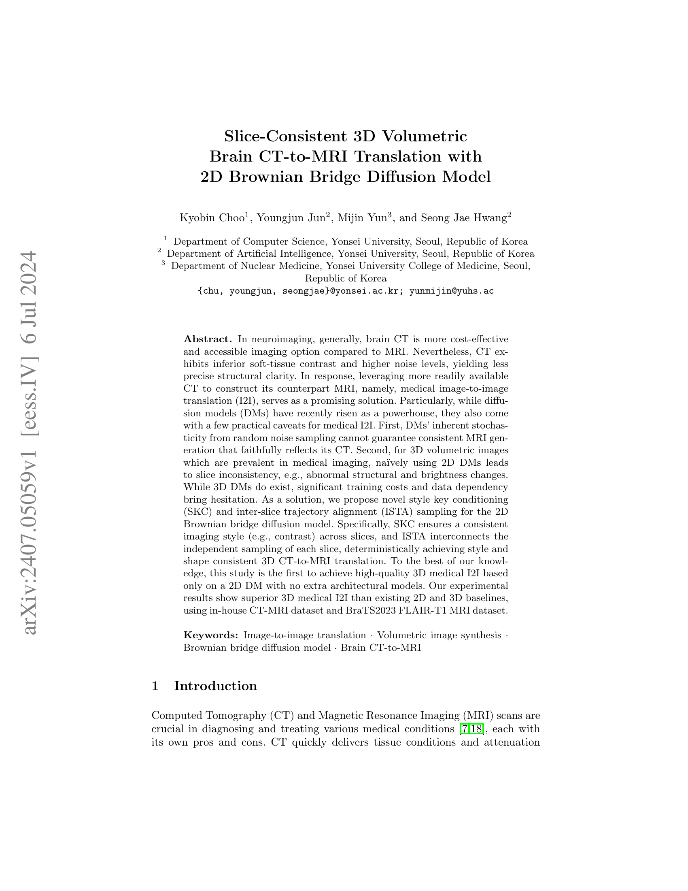
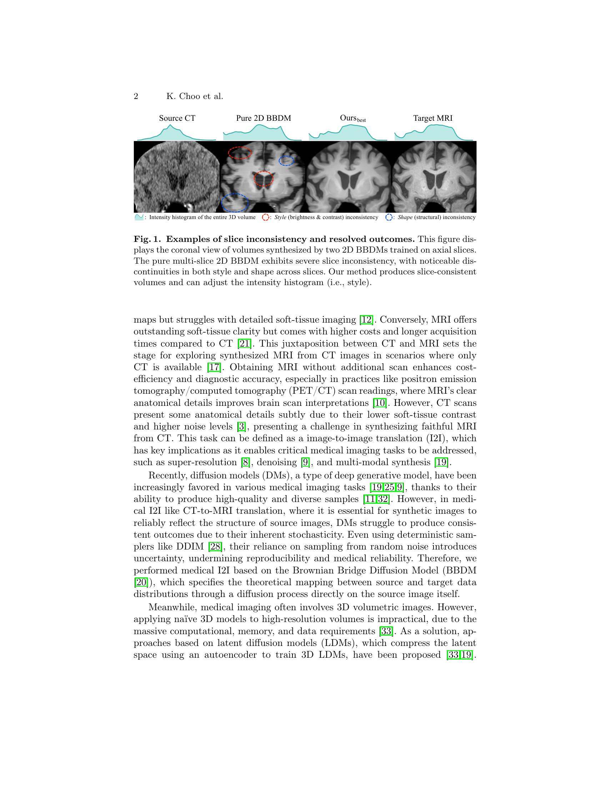
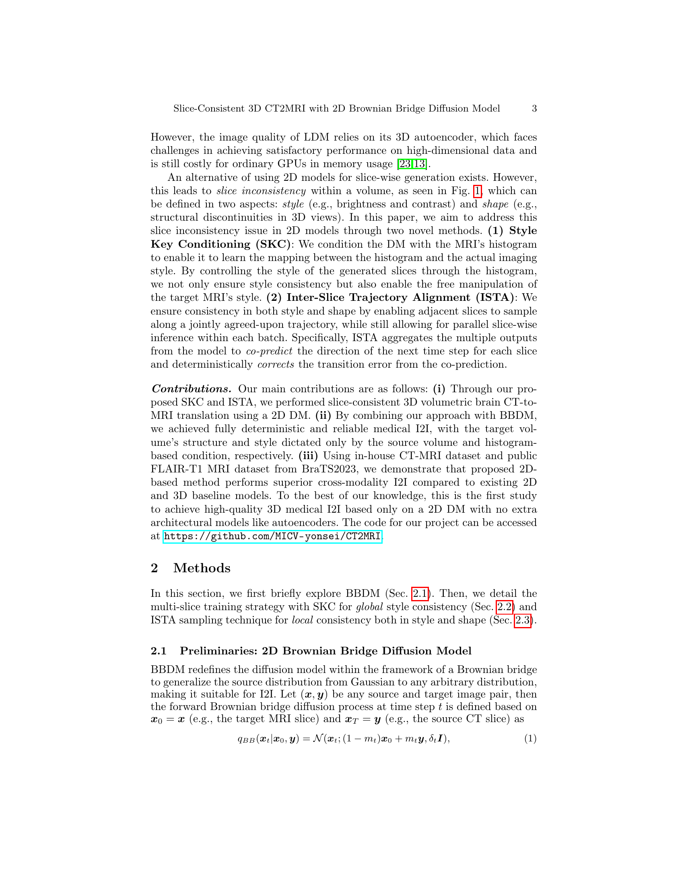
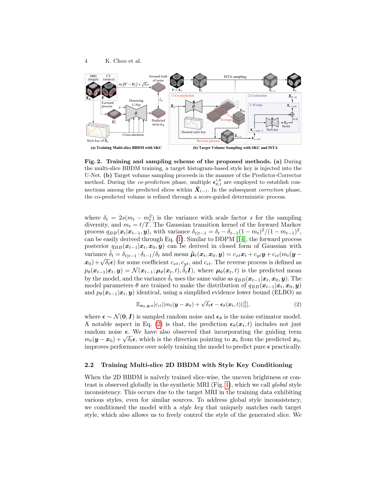
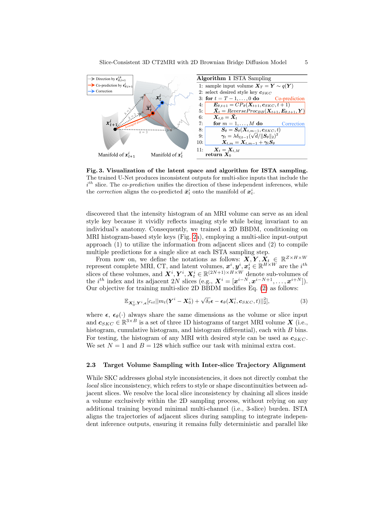
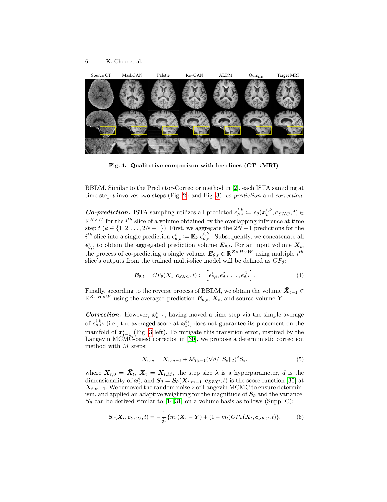
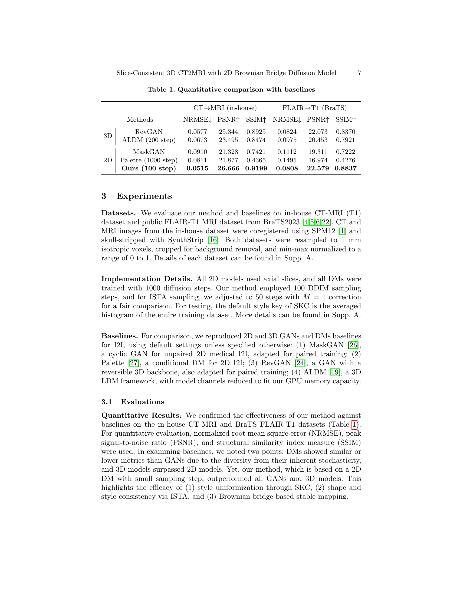
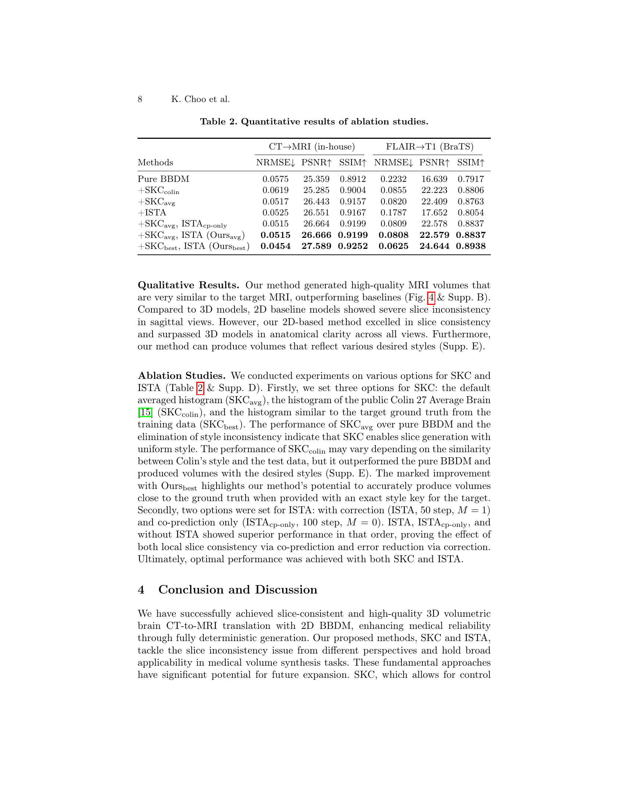
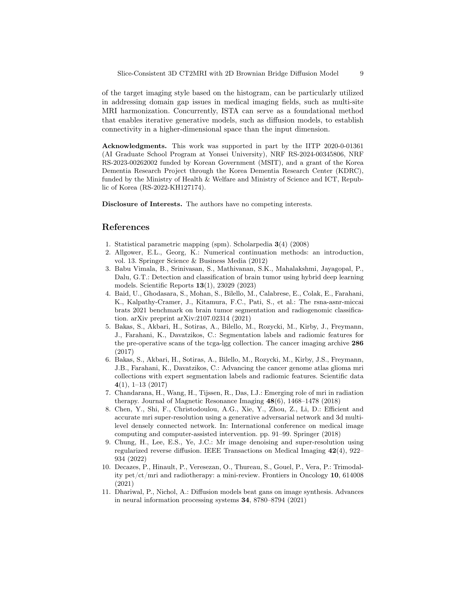
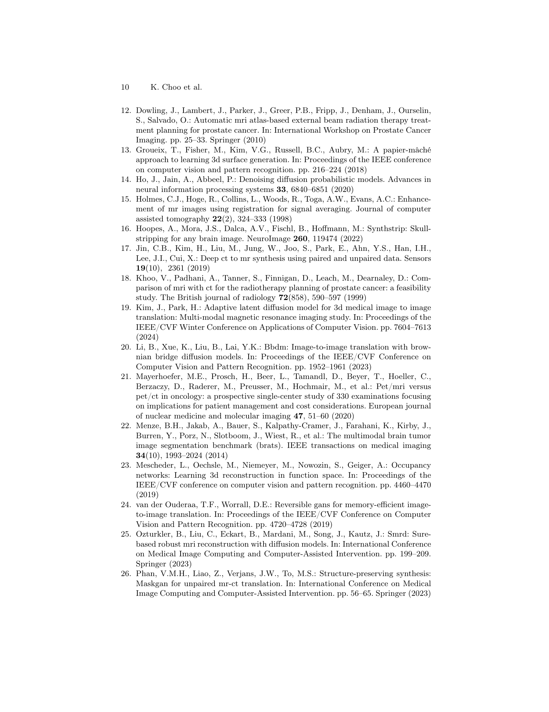
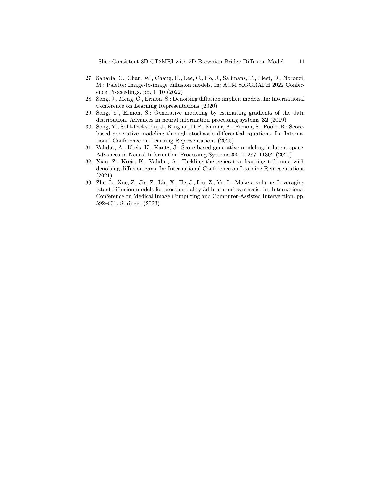
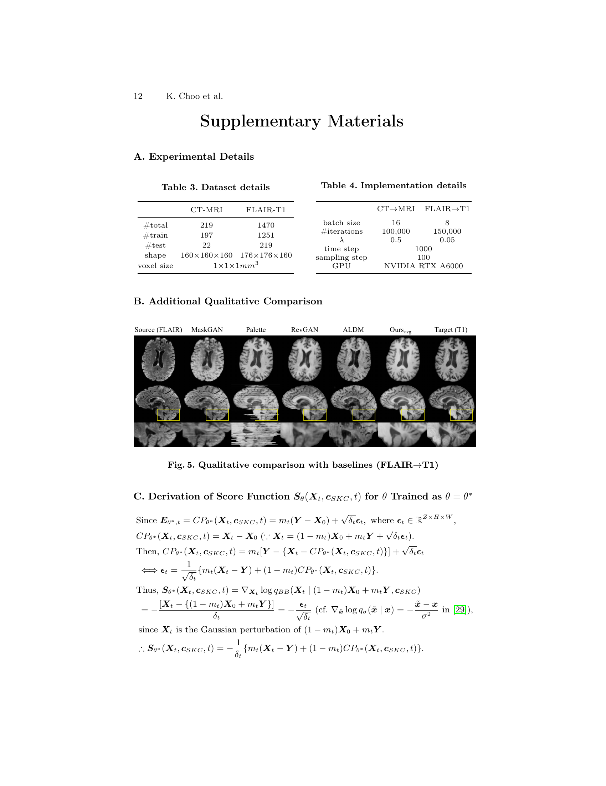
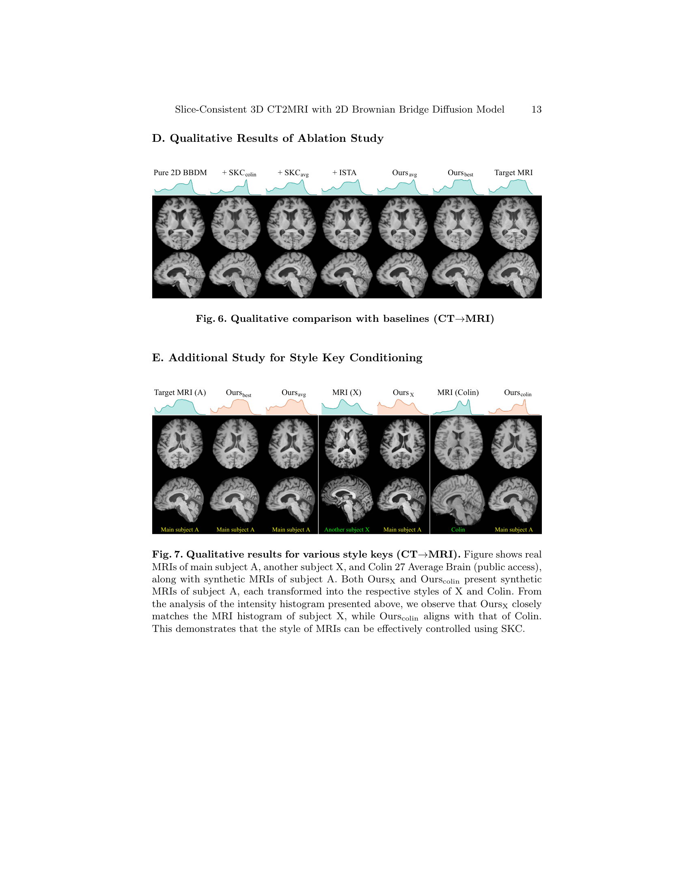
