 


 2407.05683 
 Inye Na et el. 
 



↗ arXiv


↗ Hugging Face


↗ Papers with Code


### TL;DR



Medical imaging often struggles with limited and imbalanced datasets, hindering the development of effective AI models.  Acquiring high-quality data is challenging due to privacy concerns and labeling costs.  Generating synthetic data is one solution, but existing methods often lack the ability to precisely control important biological features. 

This research introduces RadiomicsFill-Mammo, a novel approach to generate synthetic mammogram images.  It uses radiomics features—low-dimensional yet biologically meaningful markers derived from medical images—to guide the generation process. The study employed a stable diffusion model, incorporating clinical variables like BI-RADS and breast density to create diverse and realistic images. Results indicate that the generated images closely match real mammograms in terms of radiomics features and enhance the performance of downstream tasks like tumor detection.  The availability of code further increases the impact of this method.



#### Key Takeaways


 RadiomicsFill-Mammo effectively generates realistic synthetic mammogram tumor images based on various conditions. 



 The method improves mass detection in downstream tasks using simulated samples. 



 RadiomicsFill-Mammo demonstrates adaptability to small external datasets, enabling broader applications in medical imaging. 


#### Why does it matter?
This paper is important because it introduces a novel method for generating synthetic mammogram images with specific radiomics features.  This addresses the critical need for high-quality, diverse training data in medical image analysis, particularly in situations with limited real data due to privacy or cost. The method's ability to generate realistic tumor images with controllable features opens new avenues for improving model development and enhancing treatment planning.

------
#### Visual Insights

> 🔼 RadiomicsFill-Mammo is a stable diffusion model used for generating synthetic mammogram images containing masses.  The model takes as input a masked mammogram (where the mass area is masked), an image of the opposite breast, and a set of radiomic features and clinical conditions describing the desired mass characteristics (e.g., size, shape, texture, density, BI-RADS score). It iteratively refines a noisy latent representation by incorporating information from both the masked and unmasked regions of the input image, the contralateral breast, and the specified conditions, ultimately generating a realistic synthetic mammogram with a mass that matches the input parameters.
> 

> 
read the caption

> Figure 1: Overview of the RadiomicsFill-Mammo model, a stable diffusion-based architecture. This model performs iterative denoising for tumor inpainting within masked regions on a noisy latent vector, utilizing information from unmasked regions, the opposite breast, and specific tumor conditions.
> 


| Prompt type | FID ↓ | PSNR ↑ | SSIM ↑ | MS-SSIM ↑ |
|---|---|---|---|---|
| MassTextFill | 0.1144 | 32.4783 | 0.8395 | 0.9461 |
| ClinicalTextFill | 0.0989 | 33.1762 | 0.8430 | 0.9495 |
| RadiomicsFill-MLP | 0.0874 | 32.7828 | 0.8322 | 0.9498 |
| RadiomicsFill-MET | **0.0570** | 32.8009 | **0.8535** | **0.9507** |

> 🔼 This table presents a quantitative evaluation of the quality of synthetic tumors generated by the RadiomicsFill-Mammo model.  It compares the performance of four different model configurations ('MassTextFill', 'ClinicalTextFill', 'RadiomicsFill-MLP', and 'RadiomicsFill-MET') across four key metrics: Fréchet Inception Distance (FID), Peak Signal-to-Noise Ratio (PSNR), Structural Similarity Index (SSIM), and Multi-Scale Structural Similarity Index (MS-SSIM). Lower FID scores indicate better image quality, while higher PSNR, SSIM, and MS-SSIM scores suggest greater similarity to real tumor images. This table allows for a comparison of the effectiveness of different prompt encoding strategies in generating realistic and high-quality synthetic tumor images.
> 

> 
read the caption

> Table 1: Synthetic Tumor Quality Assessment.
> 

### In-depth insights

#### Synth. Mammogram Gen.
Synthetic mammogram generation is a crucial area of research focusing on creating realistic mammogram images with specific attributes.  This is vital for addressing data scarcity and imbalance issues common in medical imaging.  **RadiomicsFill-Mammo**, as presented in the paper, is a significant advancement in this field, leveraging the power of radiomics features and stable diffusion models.  The technique effectively bridges the gap between low-dimensional, biologically meaningful radiomics data and complex medical image generation.  By incorporating clinical variables like BI-RADS scores and breast density, along with radiomics features, the model achieves a high degree of control and realism in generating synthetic mammograms. This method is not just about creating images; it offers a powerful tool for enhancing downstream tasks such as mass detection, where simulated samples generated by RadiomicsFill-Mammo significantly improve model performance.  **The ability to fine-tune the model on smaller external datasets further increases its applicability and potential impact on medical imaging research.** Ultimately, this method demonstrates the potential for creating comprehensive synthetic data for medical AI training, leading to advancements in image analysis and potentially better clinical decision-making.

#### Radiomics-driven Synth.
A hypothetical section titled "Radiomics-driven Synth." in a research paper would likely explore the creation of synthetic medical images using radiomics features.  This approach offers a powerful way to address the limitations of real-world datasets, which often suffer from **small sample sizes, class imbalances, and high annotation costs.** Radiomics, with its ability to extract quantitative features from medical images, provides a **low-dimensional yet biologically meaningful representation** that can be used to guide the synthesis process.  The core idea would likely revolve around training a generative model (e.g., GAN, diffusion model) to generate synthetic images that match specified radiomics profiles.  This offers **precise control over the characteristics of the generated data**, allowing researchers to create synthetic tumors, lesions, or other pathologies with desired features.  The resulting synthetic data could then be used to augment existing datasets, improve the training of machine learning models, or enable simulation studies for various medical applications.  A crucial aspect of such a section would be a rigorous evaluation of the generated images' quality and biological realism, potentially through comparison with real-world data using metrics like visual similarity, radiomics feature consistency, and downstream task performance.

#### Stable Diffusion App.
A hypothetical "Stable Diffusion App." built upon the research paper's findings would likely leverage the power of **stable diffusion models** to generate synthetic mammograms with precise control over radiomics features.  The app would allow users to specify desired tumor characteristics, such as size, shape, texture, density, and BI-RADS score.  **Integration of a trained tabular encoder** would be crucial, allowing for the input of various radiomics features (and perhaps clinical data) in a structured format.  This would enable the model to generate realistic and diverse synthetic images that accurately reflect the specified parameters.  The application might include tools for masking and inpainting, allowing for creation of images with masses at specific locations within the breast.  **A key feature would be the ability to control mass generation for both normal and abnormal cases,** creating a balanced dataset suitable for training and evaluating downstream medical AI applications.  The app could also offer quality assessment tools, to evaluate the realism of the produced mammograms.  **Ultimately, such an app would serve as a valuable tool for medical research and AI development**, accelerating progress by providing synthetic data for training and testing models while addressing the limitations imposed by scarce or imbalanced real-world datasets.

#### Downstream Task Boost
A hypothetical 'Downstream Task Boost' section in a research paper on synthetic medical image generation would likely detail how the generated data improves performance on subsequent tasks.  It would likely showcase **improved accuracy, sensitivity, or specificity** in downstream applications such as classification, detection, or segmentation.  The analysis would probably include quantitative metrics (e.g., AUC, precision, recall, F1-score) comparing models trained with augmented datasets (including synthetic images) against those trained solely on real data.  **A key element would be demonstrating the effectiveness of synthetic data in addressing data scarcity or imbalance** in real-world datasets. The section might also discuss the generalizability of models trained on the synthetic data to unseen datasets or clinical settings, illustrating **robustness and applicability beyond the training data**.  Furthermore, a discussion of the computational cost of generating synthetic images and comparing it to the potential gain in downstream performance would add to the completeness.  Finally, a discussion of the limitations of using synthetic data and potential biases introduced during generation would be essential for responsible and accurate reporting of results.

#### Ext. Dataset Adaptability
The ability of a model to adapt to external datasets, as demonstrated in the study's 'Ext. Dataset Adaptability' section, is crucial for real-world applications.  **Successful adaptation showcases the model's generalizability and robustness**, minimizing the need for extensive retraining on each new dataset.  This is especially important in medical imaging where data acquisition is often costly, time-consuming, and subject to privacy concerns. The evaluation using an external dataset (INbreast) reveals how effectively the model handles data heterogeneity, a significant challenge in AI. **Fine-tuning strategies, like using Low-Rank Adaptation (LoRA) modules, further enhance the model's adaptability by minimizing resource needs and potential overfitting**. Demonstrating performance improvement on external datasets verifies practical usability and strengthens the claim of the model's effectiveness as a reliable tool for wider applications.  **The results highlight not only technical proficiency but also the practical implications of the model's real-world potential**.  Further research investigating adaptability across even more diverse datasets and clinical contexts would solidify these findings and showcase the true extent of the model's capabilities.

### More visual insights

More on figures

> 🔼 The figure illustrates the pretraining process for the tabular encoder used in the RadiomicsFill-Mammo model.  The encoder takes both unmasked (radiomics features and their embeddings) and masked (mask token and masked feature embeddings) inputs.  The unmasked inputs are concatenated and fed to the encoder, while the masked inputs are fed to the decoder which attempts to reconstruct the tumor characteristics.  After pretraining, the encoder is frozen and used for tumor inpainting in the main model.  This pretraining process ensures that the encoder learns to represent clinically relevant information from the radiomics features effectively.
> 

> 
read the caption

> Figure 2:  Pretraining Process of the Tabular Encoder. Unmasked feature values (i.e., radiomics features) and their embeddings are concatenated for the encoder input. For masked features, a mask token and the masked feature’s embeddings are concatenated, forming the input for the decoder, which focuses on reconstructing tumor conditions. Following pretraining, the encoder is frozen, and its output is utilized for tumor inpainting.
> 

> 🔼 Figure 3 illustrates four different configurations for encoding prompts used in the RadiomicsFill-Mammo model. Each configuration uses a different type of prompt encoder, specialized for a specific kind of input.  MassTextFill (a) and ClinicalTextFill (b) use simple text-based prompts and pretrained encoders, which are not further trained. RadiomicsFill-MET (d) also uses a pretrained encoder, however, it employs a more sophisticated method (MET) for encoding tabular data that incorporates radiomics features. In contrast, RadiomicsFill-MLP (c) utilizes a multi-layer perceptron (MLP) as its encoder, training this component jointly with the image generation model. The figure highlights the diverse approaches to prompt encoding and shows the design choices made to tailor the model to different types of input data.
> 

> 
read the caption

> Figure 3: Different Configurations of Prompt Encoders. Each configuration employs a prompt encoder specialized for its prompt type. Configurations (a) MassTextFill, (b) ClinicaltextFill, and (d) RadiomicsFill-MET utilize pretrained and frozen prompt encoders, whereas the encoder for (c) RadiomicsFill-MLP consists of three MLP layers and is trained alongside the generator.
> 

> 🔼 Figure 4 demonstrates the consistency of radiomics features between real and synthetic mammogram masses generated by RadiomicsFill-Mammo.  Panel (a) uses grouped violin plots to compare the distributions of shape, histogram, gray-level co-occurrence matrix (GLCM), and gray-level size zone matrix (GLSZM) features for real and synthetic masses.  The close similarity of the distributions visually confirms the model's ability to generate realistic radiomics feature values. Panel (b) provides a direct visual comparison of real and synthetic mammogram masses, with red arrows indicating the locations of the masses. Histograms below each image display the values for all 67 extracted radiomics features, further emphasizing the close agreement between real and synthetic data.
> 

> 
read the caption

> Figure 4:  Radiomics Feature Consistency Between Real and Synthetic Masses. (a) Grouped violin plots for shape, histogram, and texture (GLCM and GLSZM) features, contrasting real (left) and synthetic (right) distributions. (b) Visual comparison of real and synthetic masses, with red arrows highlighting masses and histograms visualizing the 67 extracted radiomics features underneath.
> 

> 🔼 This figure demonstrates the ability of the RadiomicsFill-Mammo model to generate synthetic tumors with varying shapes while maintaining consistent histogram and texture features.  The process starts with an image containing a mass, which is replaced with normal tissue using a 'normal' prompt. Then, synthetic tumors of progressively increasing size are generated at random locations within the image.  The red arrows highlight the location of each generated tumor, and the histograms below each image show the radiomics features extracted from the tumor area, demonstrating consistency in texture and histogram features despite varying shapes.
> 

> 
read the caption

> Figure 5: Progressive Shape Variation in Synthetic Tumors. Starting with an image containing a mass, we use a normal prompt to replace the mass area with normal tissue. Then, at random positions, we generate synthetic tumors of increasing size, keeping histogram and texture features consistent. Red arrows in each image point to the mass. Below each image, histograms display the radiomics features extracted from the tumor areas.
> 

> 🔼 This figure demonstrates the evaluation framework for assessing the pretrained tabular encoder's performance.  The encoder was initially trained with both radiomics and clinical features. However, during evaluation, clinical features were removed, leaving only the 67 radiomics features as input. The encoder's output was then used for binary classification (benign vs. malignant) of BI-RADS assessments via logistic regression.  The accuracy of this classification highlights how effectively the Masked Encoding for Tabular data (MET) method used by the encoder captures clinically relevant information from the radiomics features alone, even without clinical data.
> 

> 
read the caption

> Figure A: Evaluating Framework for the Efficiency of the Pretrained Tabular Encoder. During the training phase, clinical variables were included alongside radiomics features. For evaluation, all clinical variables were masked, and only the 67 radiomics features were fed into the encoder. The encoder’s output, once flattened, served as input for a logistic regression model tasked with a binary classification of BI-RADS into benign and malignant categories. The predictive performance of this model highlights the efficacy of MET in capturing clinically relevant information from radiomics features alone.
> 

> 🔼 This figure displays the results of an experiment to find the optimal hyperparameters for the Masked Encoding for Tabular data (MET) model.  The experiment varied the dimensionality of the feature embeddings (4, 8, 16, 32, 64), the number of encoder layers (3, 6), and the number of decoder layers (3, 6).  For each combination of hyperparameters, the model was trained using different feature masking rates (0% to 100%). The area under the curve (AUC) for benign/malignant predictions is plotted against the masking rate for each set of hyperparameters. The combination with the best AUC score at a 90% masking rate—32-dimensional feature embeddings, 6 encoder layers, and 3 decoder layers—is highlighted in hot pink and was selected as the configuration for RadiomicsFill-MET.
> 

> 
read the caption

> Figure B: Optimizing MET Parameters: AUC Performance Across Masking Rates. This graph tracks AUC scores for benign/malignant predictions at various feature masking rates to determine MET’s optimal parameters. Highlighted in hot pink, the best-performing setup—featuring a 32-dimensional feature embedding, 6 encoder layers, and 3 decoder layers at a 90% masking rate—was chosen as the prompt encoder configuration for RadiomicsFill-MET.
> 

> 🔼 This heatmap shows the cosine similarity between the 69 individual feature embeddings learned by the Masked Encoding for Tabular data (MET) model.  Each cell represents the cosine similarity between two feature embeddings.  The brighter the color, the higher the similarity.  The heatmap is organized to visually group the features into four main categories: shape (9 features), histogram (18 features), texture (40 features), and clinical (2 features).  The strong diagonal blocks indicate high similarity within each feature category (shape features are similar to each other, histogram features are similar, etc.). The off-diagonal areas show relatively low similarity, demonstrating that the MET model effectively learns distinct representations for different feature categories.
> 

> 
read the caption

> Figure C: Cosine Similarity between MET Feature Embeddings. This heatmap visualizes the cosine similarity for MET’s 69 feature-specific embeddings, highlighting strong intra-group correlations within shape, histogram, and texture clusters. The clear block diagonal structure observed signifies the encoder’s proficiency in grouping and differentiating feature categories.
> 

More on tables


| Prompt type | L-B AP | L-M AP | H-B AP | H-M AP | mAP50 | mAP50-95 |
|---|---|---|---|---|---|---|
| Baseline | 0.7500 | 1.0000 | 0.4907 | 0.5056 | 0.5438 | 0.3569 |
| MassTextFill-1x | 0.5833 | 0.7500 | 0.4352 | 0.3708 | 0.4378 | 0.2488 |
| MassTextFill-2x | 0.7778 | 0.8333 | 0.4815 | 0.4045 | 0.4900 | 0.3301 |
| ClinicalTextFill-1x | 0.5417 | 0.6667 | 0.4047 | 0.2921 | 0.3871 | 0.2245 |
| ClinicalTextFill-2x | 0.9444 | 1.0000 | 0.5648 | 0.5281 | 0.6006 | 0.3754 |
| RadiomicsFill-MLP-1x | 0.5833 | 0.8333 | 0.2963 | 0.3708 | 0.3733 | 0.2227 |
| RadiomicsFill-MLP-2x | 0.8333 | 0.9167 | 0.5648 | 0.5730 | 0.6037 | 0.3784 |
| RadiomicsFill-MET-1x | 0.5000 | 0.7500 | 0.3796 | 0.4157 | 0.4240 | 0.2550 |
| RadiomicsFill-MET-2x | **1.0000** | **1.0000** | **0.5648** | **0.6292** | **0.6429** | **0.3935** |
> 🔼 This table presents the performance of different mass detection models on the VinDr-Mammo test set.  The models are evaluated using average precision (AP) and mean average precision (mAP) metrics for different density and malignancy categories (Low-density benign [L-B], Low-density malignant [L-M], High-density benign [H-B], High-density malignant [H-M]).  The baseline represents the performance of a model trained only on real data, while other rows show results for models using synthetic data generated by different methods, with and without additional real data augmentation. mAP50 and mAP50-95 indicate the mAP calculated using only the top 50 and top 50-95 detections, respectively. This allows for a comparison of the models' abilities to detect masses of different difficulty levels.
> 

> 
read the caption

> Table 2: Mass detection performance on the VinDr-Mammo test set. AP; average precision. mAP; mean AP.
> 


| Prompt type | L-B AP | L-M AP | H-B AP | H-M AP | mAP50 | mAP50-95 |
|---|---|---|---|---|---|---|
| Baseline | 0.3333 | 0.7778 | 0.3846 | 0.2500 | 0.5800 | 0.3978 |
| MassTextFill | 0.5000 | 0.7778 | 0.6923 | 0.2500 | 0.6800 | 0.4511 |
| ClinicalTextFill | 0.5000 | 0.7778 | 0.6154 | 0.5000 | 0.6800 | 0.4533 |
| RadiomicsFill-MLP | **0.6667** | **0.8519** | 0.4615 | 0.5000 | 0.7000 | 0.4689 |
| RadiomicsFill-MET | 0.5000 | 0.8148 | **0.7692** | **0.5000** | **0.7400** | **0.4711** |
> 🔼 Table 3 presents the performance of different mass detection models on the INbreast dataset.  The models tested include a baseline model trained only on real data, and several versions of the RadiomicsFill-Mammo model using different prompt types and configurations (MassTextFill, ClinicalTextFill, RadiomicsFill-MLP, and RadiomicsFill-MET). The table displays the average precision (AP) for mass detection across four categories: low-density benign (L-B), low-density malignant (L-M), high-density benign (H-B), and high-density malignant (H-M).  Additionally, it provides the mean average precision (mAP) at different Intersection over Union (IoU) thresholds (mAP50 and mAP50-95), reflecting overall model performance.
> 

> 
read the caption

> Table 3: Mass detection performance on the INbreast dataset.
> 

### Full paper


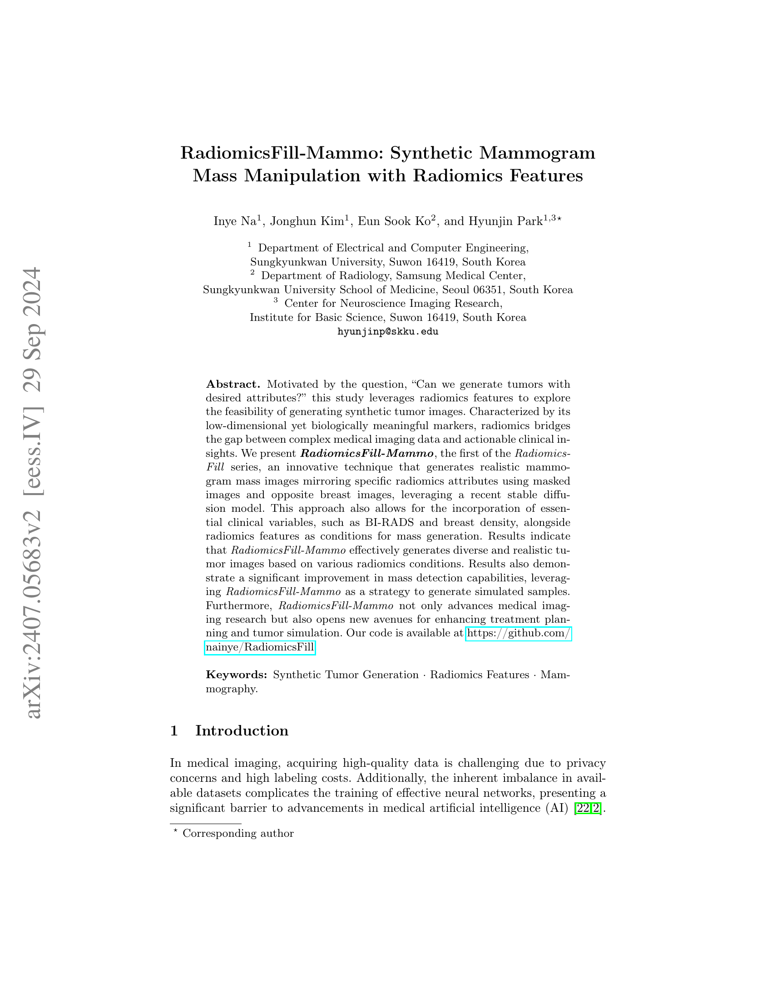
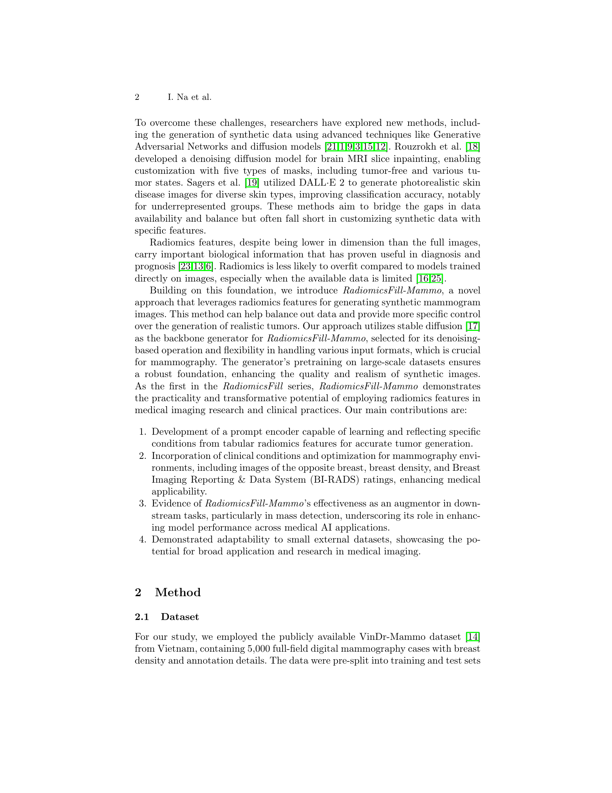
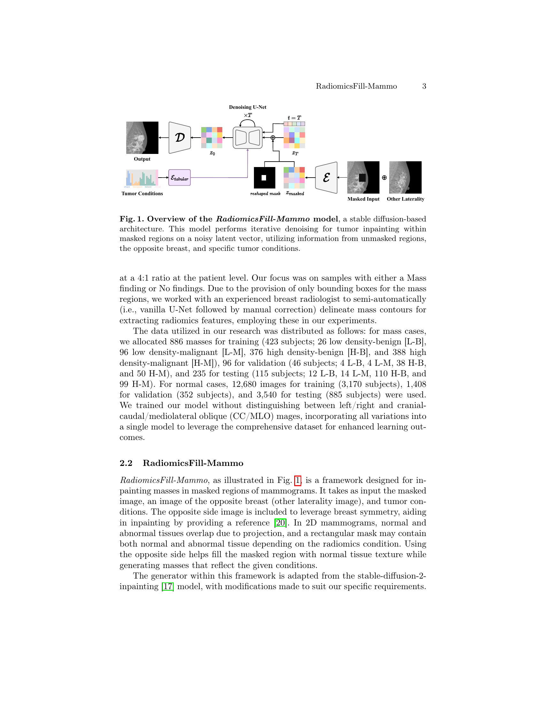
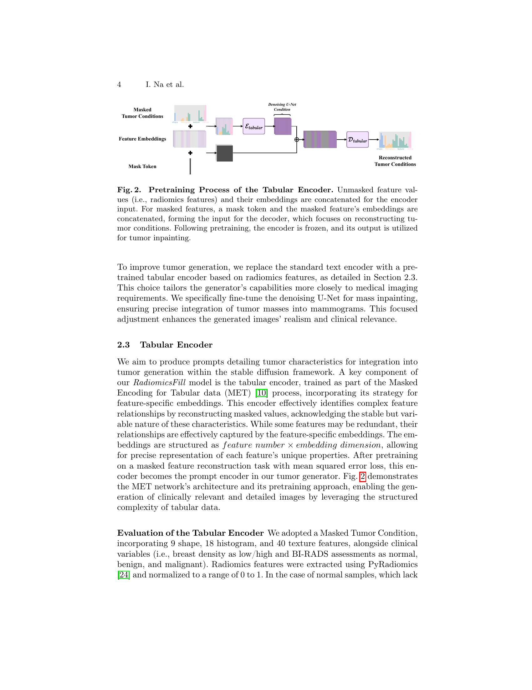
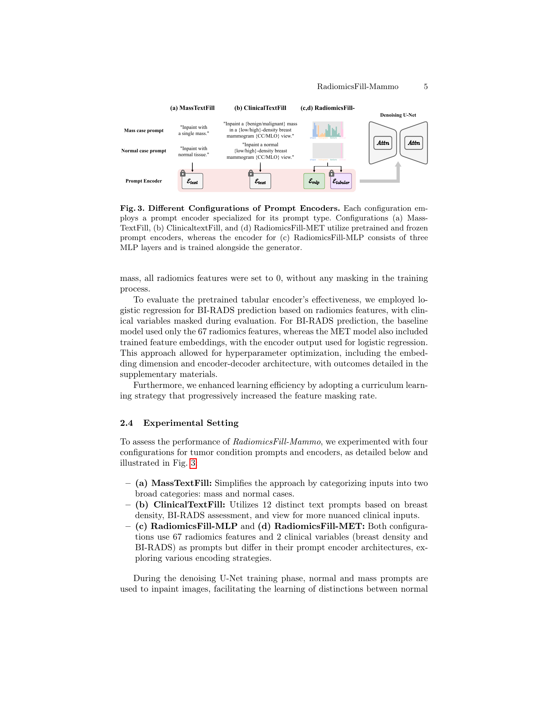
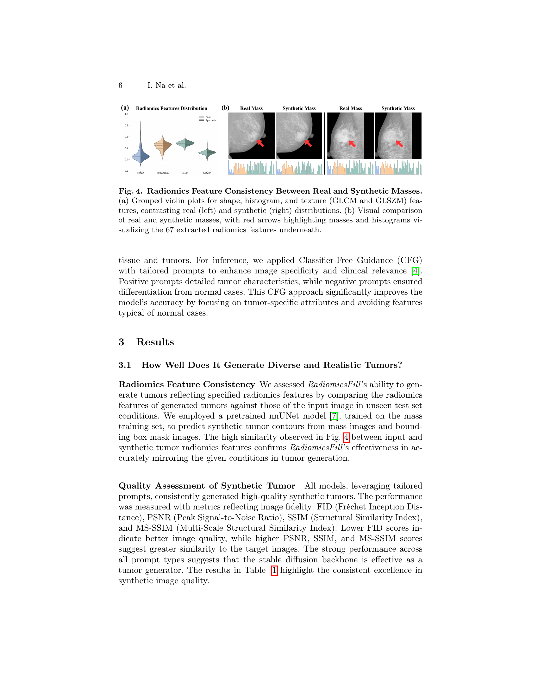
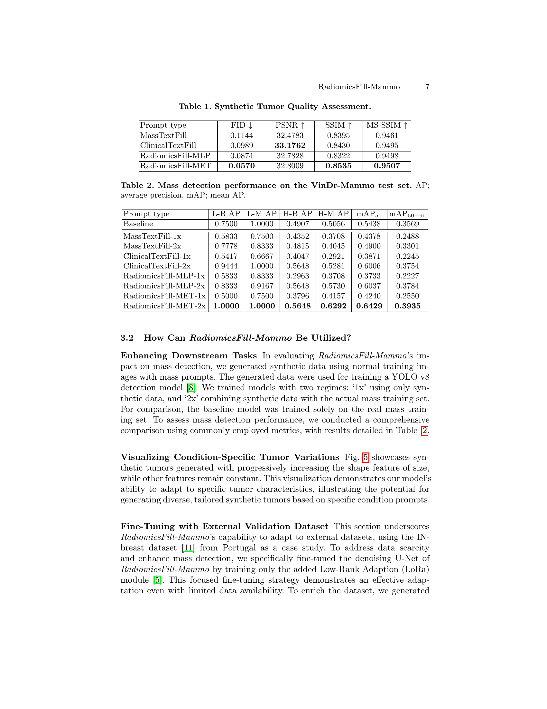
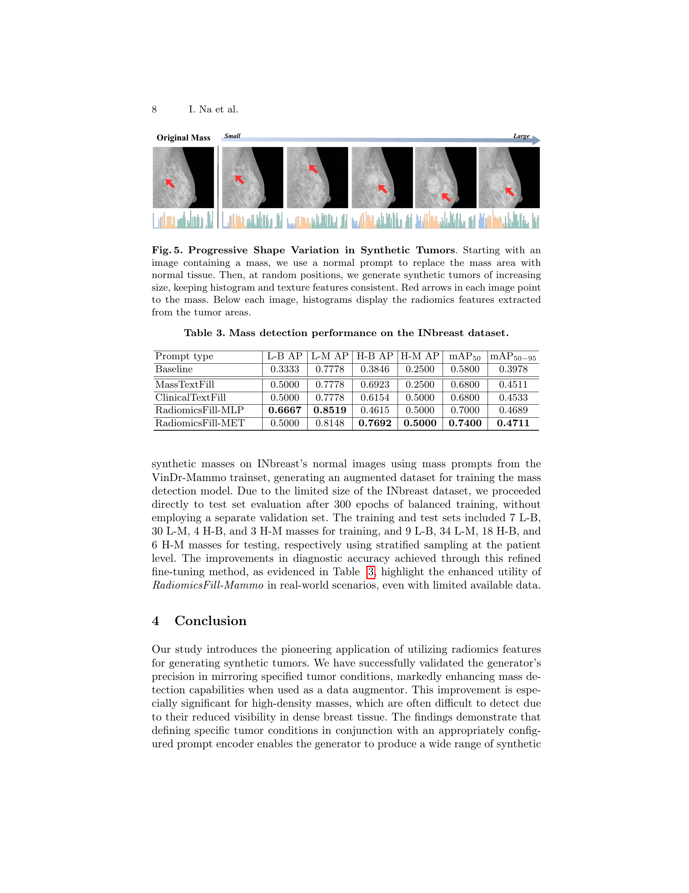
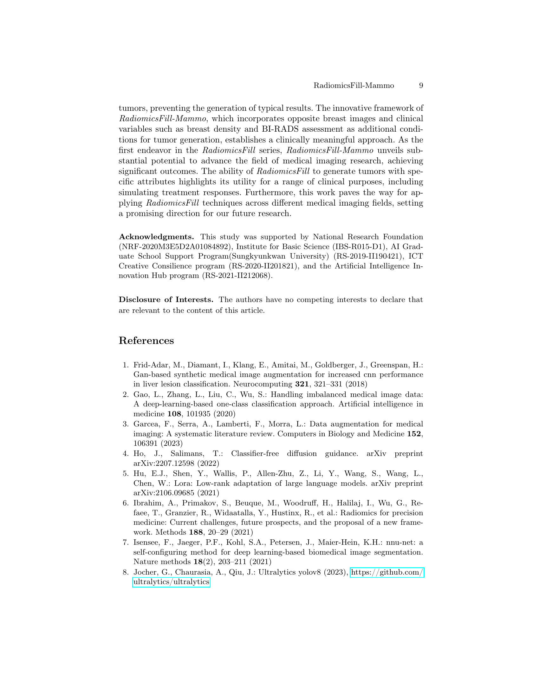
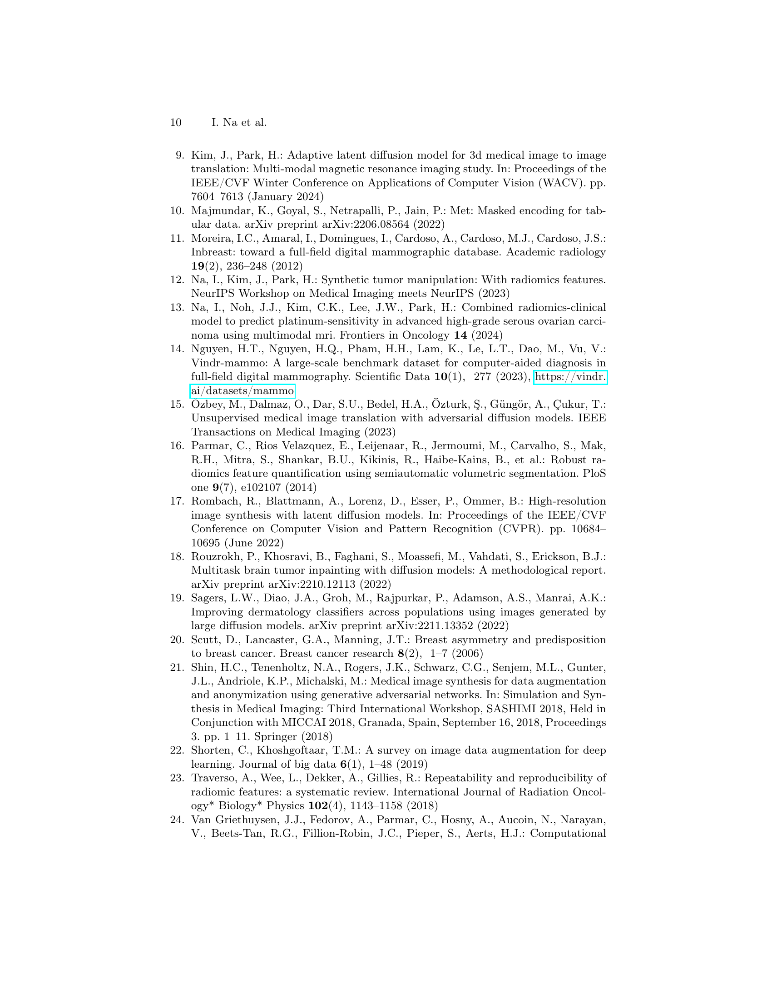
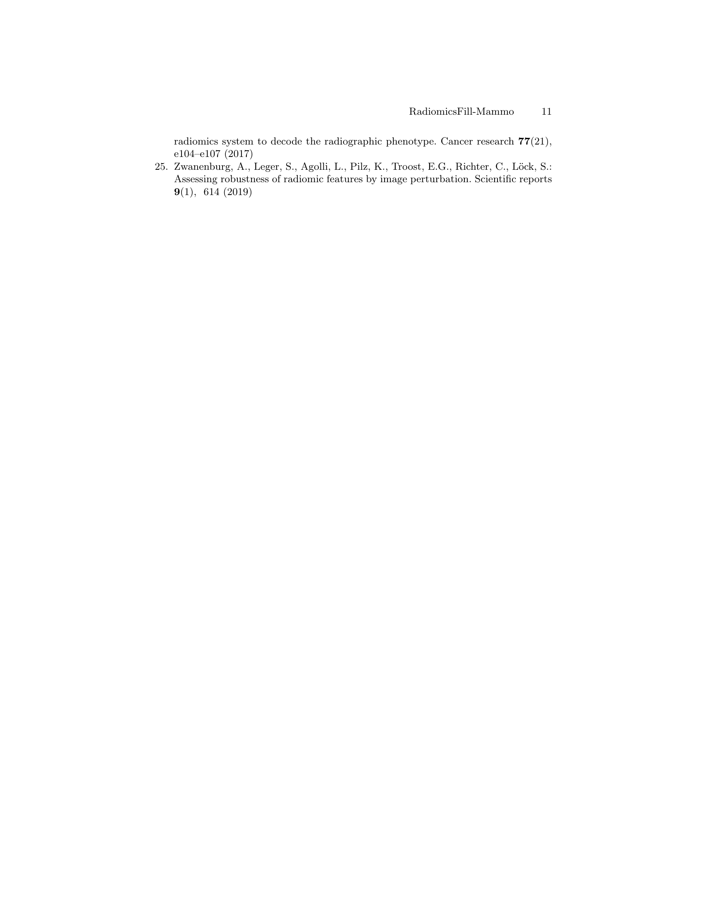
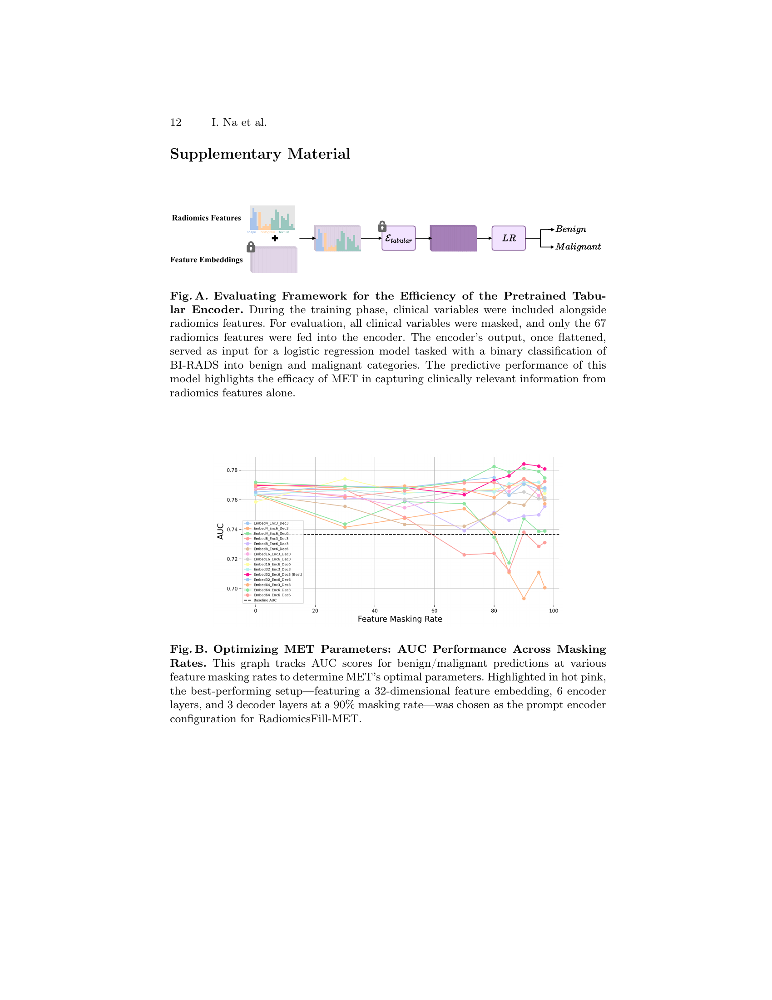
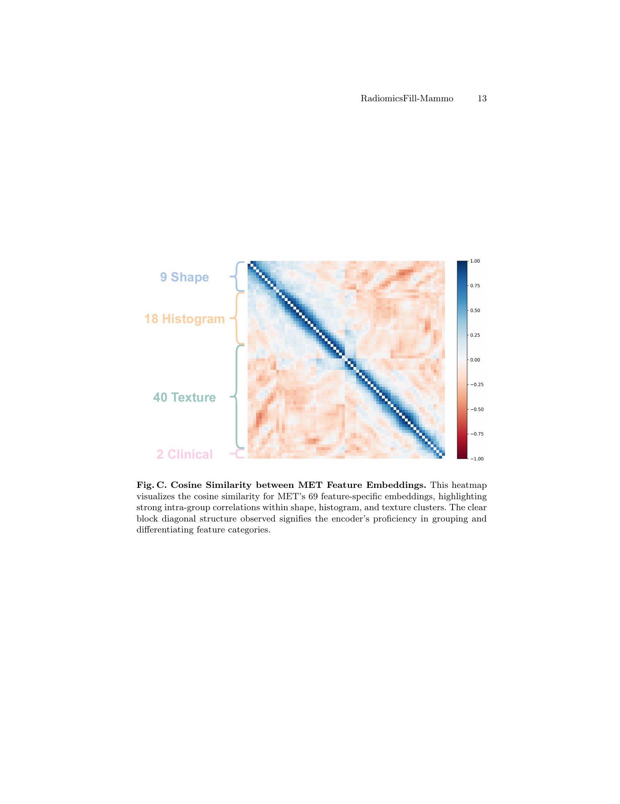
